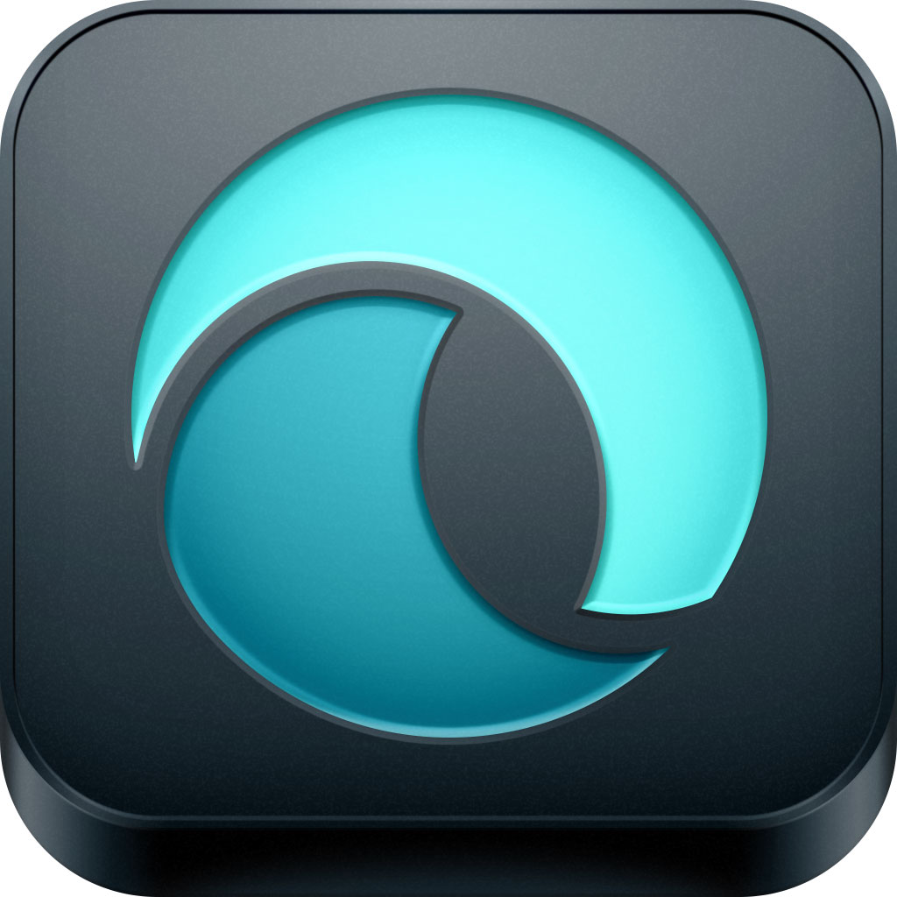
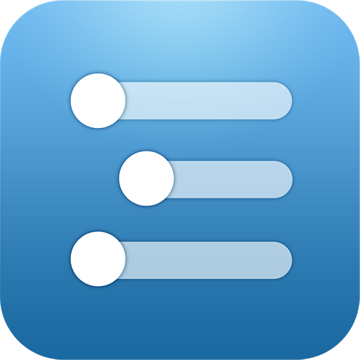
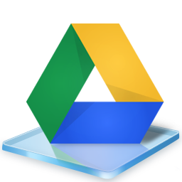
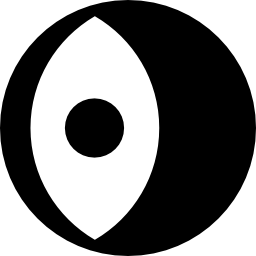
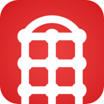

# App Icons
###### **DISCLAIMER:** I do not own any of the images in this repository, nor their copyrights. Copyright belongs to the original creators and/or owners. I utilize these images and the GitHub service with the understanding that I am not violating any law in doing so. If any legal concern were to arise regarding my use of said images or the GitHub service, please contact me immediately, and I will enact any and all measures necessary to rectify the situation.

---
## 1024 px

## 600 px

## 512 px

## 500 px

## 300 px

## 256 px

## 248 px

## 196 px

## 175 px

## 141 px

